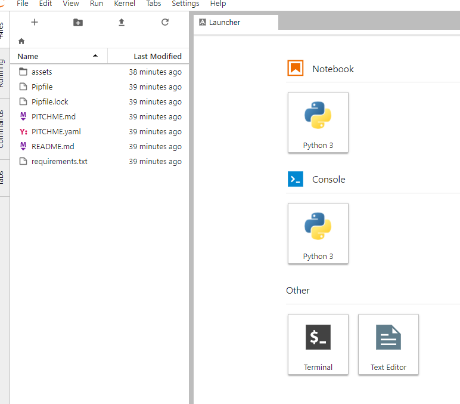
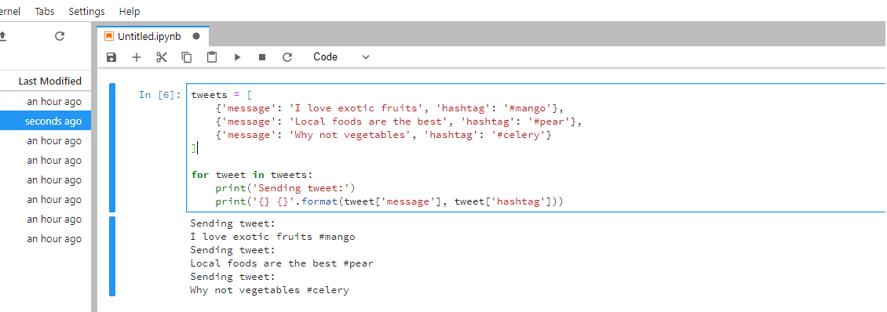

## Python 101
### Introduction to Python @Cegeka

---

## Introduction

- Short course  <!-- .element: class="fragment" -->
- Very hands-on, project in every course  <!-- .element: class="fragment" -->
- Repetition, repetition, repetition  <!-- .element: class="fragment" -->

Note:
This will be a short course, that covers the main features of python.
We won't go into details, but we want you to get a solid understanding
of the basics and where to look if you have questions (yes, you will
become an expert python googler).

In programming, practice is better than theory, so in every course
we'll have a hands-on project.

To learn something, you need to repeat it enough times that it becomes
a part of your thought. This is why over the course we will use use
the same concepts again and again in different contexts.

---

## Rules

- Interactive course, you can ask me any question at any time  <!-- .element: class="fragment" -->
- No question is a dumb question  <!-- .element: class="fragment" -->

Note:
Since this is a hands on course, it's meant to be interactive.
Ask me any question at any time.
I mean it, no question is a dumb question

---

## Project - Hashtag

- Simple project
- We'll add more features to every course
- Reads a list of hashtags and messages and publishes them to twitter
using the twitter API

---

- Steps:
  - Start with a hardcoded list and print it in the terminal (Course 1)
  - Read the input from excel and use the twitter API (Course 2)
  - Create a web server that does this action when requested (Course 3)

In the last course we'll have a hackaton with your own ideas.

---

## Course 1
### Introduction to programming and Python


---

### What we'll cover today

- What is programming
- What is Python and what sets it apart
- Basic programming concepts
- Project **Hashtag** - part 1

---

### Programming

> Input data -> Instructions -> Output data

Also known as *coding*.


Note:
At the fundamental level, this is what programming is.
Giving a machine instructions to process data in order to create
new data.

---

### Abstractions

A modern computer abstracts the basic

`(in -> instructions -> out )` through many abstractions:
- assembly
- programming languages
- programming interfaces
- operating systems
- user interfaces
- virtualization

Note:
Over the last decades, the goal of computing was to create
abstractions.
A modern computer encapsulates data and instructions through many
abstractions.
This is a pattern in computing:
* something is regarded as too complex to work with directly (assembly)
* an abstraction is created (programming languages)
* people start using the abstraction which allows more complex systems
* another abstraction is created (scripting languages)
* the cycle repeats

---

### Instructions

A CPU has a very limited set of instructions:
```asm
INC COUNT        ; Increment the memory variable COUNT

MOV TOTAL, 48    ; Transfer the value 48 in the
                 ; memory variable TOTAL

ADD AH, BH       ; Add the content of the
                 ; BH register into the AH register

AND MASK1, 128   ; Perform AND operation on the
                 ; variable MASK1 and 128

ADD MARKS, 10    ; Add 10 to the variable MARKS
MOV AL, 10       ; Transfer the value 10 to the AL register
```

Note:

As you can see, what the machine does is pretty cryptic.
(And this is at a human readable level).
But with this base, it can perform any computation.

---

### Programming languages

- abstract underlying hardware and software (operating systems)
- provide easy to use concepts to create any instruction
- This is where `Python` comes along 😊 (finally)


---

### Python

Python is general purpose programming language with the goals of:
- ease of use
- readability
- ergonomics

---

Which one do you understand better?

```java
public class HelloWorld {
    public static void main(String[] args) {
        System.out.println("Hello, World");
    }
}
//java
```

```python
print('Hello world')
# python
```

```ruby
puts('Hello world')
# ruby
```

Note:

As you can see, python values brevity (small instructions), but also
 clarity.

The java version is obviously very long, though you can pretty much
guess that `System.out.println` prints to the console.

Ruby values brevity, but it's not immediate what `puts` means.
(It stands for put string).

This is not to say that the design of these other languages is worse,
they all have their values and guidelines, but I think `Python` really
hits its goals with ease of use and clarity
most of the time.

---

### Why `Python` ?

- simple, easy to use language
 - doesn't get in your way
- huge amount of open source libraries
 - database access, web frameworks, data science tools, etc.
 - no need to reinvent the wheel
- ease of installation
 - available by default on most Linux Distros
- third language by popularity

---

Useful for a many development paths:
 - Scripting (one off script or batch jobs)
 - Web development (Django, Flask)
 - Data science (Machine learning, Data processing, Data analysis)
 - Security (hacking, whitehat or not)
 - Gaming
 - Probably many more

---

### Why not `Python`?

- slow
- obstacles for concurrency
- operational overhead

Note:
Slow:
About 20 times slower than C/C++ for first draft algorithms
- don't be intimidated, most math calculations can be done using
high performance libraries (numpy)
- pypy (a custom python interpreter) is > 8 times faster than standard
python
Concurrency:
- historically hard to use more than 1 CPU core
- got much better in the last decade
- other languages had (and some still have) the same issues
Operational:
- the python library is pretty big (40 mb)
- a medium sized project can easily install 0.5 gb of dependencies
- solvable issues, but you need to keep them in mind


---

## Python is the perfect glue language

You can call almost any library and interact

 with any backend system through python:
- libraries made in other languages
- databases
- APIs
- authentication systems
- really, anything 😄

---

### Hashtag - version 0

```python
tweets = [
    {'message': 'I love exotic fruits', 'hashtag': '#mango'},
    {'message': 'Local foods are the best', 'hashtag': '#pear'},
    {'message': 'Why not vegetables', 'hashtag': '#celery'}
]

for tweet in tweets:
    print('Sending tweet:')
    print('{} {}'.format(tweet['message'], tweet['hashtag']))

```

Quite a lot going on, let's take it one by one.

@[1](A list holding the tweets)
@[2](A dictionary)
@[7](Take an item for each element of the list)
@[8-9](Print the resulting tweet)

---

Confused? Don't worry, we'll start with the basics.

---

Go to https://github.com/slbucur/python_course.

Here you should see a launcher button


Click on it :).

What do you see?

---

### Jupyterlab

* An Integrated Development Environment (IDE) available in your browser
* Allows you to easily run Python code in your browser
* Other languages are supported as well, which makes it easy to
experiment with them

---

### Binder.org

* An platform that lets you create Jupyterlab instances in the cloud, for free
* The instances are limited in terms of compute power, but it's nice for quick experiments
* In the next course we'll learn how to do run Jupyterlab locally

---

### Jupyter notebooks

* An interactive way to run code in the browser
* Very useful for data analysis and one-off code snippets
* Let's create one now:

---

* Copy paste the code in the first cell


* Run with `Ctrl + Enter` or the ▶️ button above

---

### Support code

* You will find the support for the first course in the
 `code` folder
* just click on the folder and open course_notebook_1.ipynb

---

### Python basics

* Variables
* Objects
* Control flow
* Functions

---
## Variables
- simple ones: string, int, float

```python
a = 'Banana'
print(a) # a string - sequence of characters
print(type(a)) # a string

a = 1
b = 2
print(a + b) # a and be are integers

a = 18
b = 5
print(a / b) # dividing a over b gives a float (rational number)

# for integer division use //
print(a // b)
```

---

### Python 2

* For python 2, dividing two integers is integer division.
* You have to cast one of the numbers to float.

```python
print(1 / 2) # 0

print(float(1) / 2) # 0.5
```

* But don't use python 2, it will be out on 1 January 2020 😀.

---

### 2 vs 3

* Right now python has two active versions, 2 and 3.
* Python 3 has many improvements in speed, syntax and  features.
* Unfortunately 3 is not entirely compatible with 2
* A few years ago, Python 2 vs Python 3 was still a debate.
* Now it's clear, Python 3 has won, and almost all active 
libraries support it.
* So unless you need to support an old application developed in Python 2,
use Python 3

---

- tuple

A sequence of things. Once initialized it can't change: `immutable`.

```python
fruits = ('mango', 'banana', 'apple')
print(', '.join(fruits)) # a basket of fruits (actually a string)

fruits[0] = 'pear' # this will error out
```

---

- list

Also a sequence of things. A list can change

(add items, remove item, change items)

```python
fruits = ['mango', 'banana', 'apple', 'monkey']

# what's that monkey doing there?
del fruits[3] # as you can see, python is 0 indexed

fruits.append['pear']
print(','.join(fruits)) # a basket of fruits (actually a string)

```

---

- dictionary

A map with keys and values.
```python

bank_account = {
    'Joe': 1,
    'Bill': 72_000_000_000, # python 3 syntax
}

print(bank_account['Joe'])
print(bank_account['Bill'])
```

Note:
What Bill is that?


---

## Objects

What do all these variables have in common?
They are **objects**

---

Everything in python is an object:

* variables
* functions
* classes
* modules

---

_But what is an object?_

A structure with that holds **data** and has **properties**

Note:
Yes, it's that simple. We're not going into Object Oriented Programming
just yet.

---

Let's take a basic example, and Integer.

It holds a value, a natural number:
* 0, 1, 2, 3 ... n
* -1, -2, -3, ... -n

---

And it has a bunch of properties:
* you can **add** another integer to it => which gives another integer
* **subtract** another integer
* **multiply**
* **divide**

---

Holds a value:
```python
a = 1
```

Add another integer
```python
a = 1
b = 2
print(a + b)
```

Subtract another integer:
```python
a = 1
b = 2
print(a - b)
```

---

Multiply
```python
a = 11
b = 653
print(a * b)
```

Divide
```python
a = 15
b = 2
print(a / b) # floating point (decimal) division
print(a // b) # integer division
```

Note:
It gets a bit interesting at division. In python 3, if you divide
two integers, by default you will get a floating point number.
Use `//` for integer division.

---

There are more properties an integer can have.

We can see them all with this:
```python
>> help(int)
```

```
class int(object)
 |  int(x=0) -> int or long
 |  int(x, base=10) -> int or long
 |
 ...
 |  4
 |
 |  Methods defined here:
 |
 |  __abs__(...)
 |      x.__abs__() <==> abs(x)
 |
 |  __add__(...)
 |      x.__add__(y) <==> x+y
 |
 |  __and__(...)
 |      x.__and__(y) <==> x&y
 |
 |  __cmp__(...)
 |      x.__cmp__(y) <==> cmp(x,y)
 |
 |  __coerce__(...)
 |      x.__coerce__(y) <==> coerce(x, y)
 |
 |  __div__(...)
 |      x.__div__(y) <==> x/y
 |
 |  __divmod__(...)
 |      x.__divmod__(y) <==> divmod(x, y)
 |
 |  __float__(...)
 |      x.__float__() <==> float(x)
```

---


Take any other basic type and let's think about the
data it holds it's properties:
* tuple
* list
* string
* dictionary

---

## Control flow

Note:
Now we have objects with properties.

We need to do things with them.

This is where control flow comes along.

---

Definition:

_Instructions to process data_

---

Think of it as a recipe:

You have:
* two eggs
* bacon
* bowl
* a stove
* and a pan

---

Steps:
1. Break the eggs
2. Cut the bacon
3. Mix them in the bowl
4. Start the stove
5. Place pan on stove
6. Wait for the pan to heat up
7. Put the mix into the bowl
8. Scramble
9. Enjoy 🍳

---

Let's try to this in python:
```python
eggs = [egg1, egg2]
bacon, bowl, stove, pan

ingredients = []

for egg in eggs:
    egg.break()
    if egg.is_good():
        ingredients.append(egg)

if ingredients.empty():
    # we have no good eggs
    order_pizza()

```

---

```python

bacon.cut()
ingredients.append(bacon)

bowl.mix(ingredients)

stove.heat()
stove.place(pan)
while pan.temperature < 100:
    wait(5)

pan.place(ingredients)

while ingredients.not_done:
    ingredients.scramble()

omlette = ingredients
omlette.enjoy()
```

---

The five elements of control flow:
* instructions
* line ordering
* conditions
* loops
* functions

---

### Instructions

Each line contains one instruction.
You can do multiple instructions using the `;` operator, but it's not
recommended.

```python
a = 1
b = 2; c = 2
```

---

### Line ordering

Instructions run in order they are ran.
If an instruction **a** is above instruction **b**, by the time we get
to **b**, **a** already ran.

```python
a = 1
print(b) # error, b is not initialized
b = 2
print(a) # a is initialized before b
```

---

### Conditions

#### if/else

If an **if** is satisfied, the code below it runs.

Otherwise, the one below **else** runs.

```python
price = 10
cash_in_pocket = 5

if cash_in_pocket >= price:
    print('You can pay with the money in your pocket')
else:
    print('Better luck next time')
```

---

#### elif

**elif** can be used to add multiple conditions to the standard
**if/else**.

```python
price = 10
cash_in_pocket = 5
cash_in_wallet = 5

if cash_in_pocket >= price:
    print('You can pay with the money in your pocket')
elif cash_in_pocket + cash_in_wallet >= price:
    print('You can pay with the money in your pocket and your wallet')
else:
    print('Better luck next time')
```

---


### Whitespace

Note:
It's time for a small side note about whitespace in python.

---

### Only one rule
Use 4 spaces for indentation

Note:
You can also use tabs, or other types of indentation, it will work,
but to make your life easy, just use 4 spaces.
It's the standard in python, as stated in PEP8 (The style guide for
python, used by almost all modern python code)

---

Whitespace is relevant in python:
* used to define code blocks:
  * if
  * while
  * for
  * functions
  * classes
* when the lines are indented under one of these blocks,
python interprets them as code blocks

---

Which one is right and why?

```python
# 1
price = 10
cash = 5
print('Tring to pay')
if cash >= price:
    print('You can buy the item')
print('Item bought')
```

```python
# 2
price = 10
cash = 5
print('Tring to pay')
if cash >= price:
    print('You can buy the item')
    print('Item bought')
```

Note:
The second one is right. The first one prints 'Item bought'
no matter how much money you have.

---

### Loop the loop


---

Loops are used to iterate. You have two options:
* **for**
* **while**

Note:
You can always create a for with a while, but not the other way around.

---

### FOR

```python
fruits = ['banana', 'strawberry', 'orange', 'plum']

for fruit in fruits:
    # python 3.6 f-strings
    print(f'I like the fruit named {fruit}')

```

---

### Side note - String formatting

##### The `.format` function

```python
# the standard way since python 2.6
# has more formatting options than %
price = 10.956
print('The item costs {} dollars'.format(price))
# bonus, show only 2 decimals
print('The item costs {0:.2f} dollars'.format(price))
```

##### F-strings

```python
# new in python 3.6
price = 10.956
print(f'The item costs {price} dollars')
print(f'The item costs {price:.2f} dollars')
```

Note:
String formatting is displaying a string in another string.

---

##### String adding
```python
# because it quickly becomes unreadable
# you also need to cast any other type but string
price = 10.956
print('The item costs ' + str(price) + ' dollars')
```


##### Percent formatting

```python
# similar to the one in C
# used in older applications and libraries
# not recommended for new apps
price = 10.956
print('The item costs %s dollars' % price)
print('The item costs %.2f dollars' % price)
```


---

#### Back to loops

```python
# multiplying board

for x in range(4):
    for y in range(4):
        print(f'{x}x{y}={x * y}')
```

This might be useful to visualize:
Go to http://www.pythontutor.com/visualize.html and copy
the code.

Note:
You see what we did there? Multiple indentations.

---

#### While

While loops the code as long as the condition is `True`

```python
#    \___/    -> soup plate
#   *-----*   -> small plate
#  *-------*  -> big plate

plates = ['soup plate', 'small plate', 'big plate']

no_plates = len(plates)
while no_plates > 0:
    next_plate = plates.pop(0)
    print(next_plate)
    no_plates = len(plates)
```

Try this this in the [visualizer](http://www.pythontutor.com/visualize.html)

Note:

ASCII art is your friend.
This structure is a stack. It's the basis of a python program.

---

#### When to use `while`?

While is more powerful than a for, but you usually need more lines
of code to use it.

```
fruits = ['banana', 'strawberry', 'plum', 'coconut']

# with while
index = 0
while index < len(fruits):
    fruit = fruits[index]
    print('I like the fruit named {}'.format(fruit))
    index += 1

# with for
for fruit in fruits:
    print('I like the fruit named {}'.format(fruit))

```

---

### List comprehensions

A powerful way to manipulate lists in python.
Easier than for for simple things.

* Access items from a list

```python
fruits = ['🍌', '🍓', '🍏', '🍐']

# indexing starts at 0
print(fruits[0]) # first item 🍌
print(fruits[2]) # third item
print(fruits[-1]) # last item

print(fruits[:2]) # first two items
print(fruits[1:3]) # 2nd and 3rd item
print(fruits[-2:]) # last two items
```
---

* Make another list

```python
fruits = ['🍌', '🍓', '🍏', '🍐']
# 'a' * 4 = 'aaaa'
fruit_packs = [ fruit * 3 for fruit in fruits]

print(fruit_packs)
```

* Filter a list

```python
fruits = ['🍌', '🍓', '🍏', '🍐', '🍺', '🍷']
not_actually_fruits = ['🍺', '🍷']

actual_fruits = [
    fruit
    for fruit in fruits
    if fruit not in not_actually_fruits
]
print(actual_fruits)
```

Note:
Multiplying a string by a number will duplicate that string.

As you can see, the filtering gets a bit complicated.
If the code seems unreadable, don't be afraid to use a proper for.

---


#### Functions

Functions are ways to couple common logic in a single
 abstraction.

You have already seen them in the last slides.

* `print`
* `len`
* `pop` (actually a method)

Note:
We'll get to methods soon enough.

---

How to use a function?
You use `<function_name>(argument1, argument2, ...)`

You will also see this quite often:
```python
function_name(*args, **kwargs)
```

---

##### Args - Arguments

* also called positional
* the order of the arguments matters
```python
print('This is positional argument 1', 'This is positional argument 2')
```

**print** will take all positional arguments and join them with a
 **space**.

---

##### Kwargs - Keyword arguments


```python
print('Positional argument 1', 'Positional argument 2', sep=',')
```

The **sep** is a keyword argument. It specifies that **print** will
 separate the positional arguments with **,** instead of **space**.

Note:

As you can see, you invoke a keyword argument by using
 `argument_name=argument_value`.

---

#### Make your own functions

#### With positional

```python
def check_fruit(fruit):
    if fruit not in ('🍺', '🍷'):
        print(f'{fruit} is a fruit')
    else:
        print(f'{fruit} is not a fruit')

fruits = ['🍌', '🍓', '🍏', '🍐', '🍺', '🍷']

for fruit in fruits:
    check_fruit(fruit)
```


---

#### With positional and keyword

```python
def check_fruit(fruit, bad_fruits=('🍺', '🍷')):
    if fruit not in bad_fruits:
        print(f'{fruit} is a fruit')
    else:
        print(f'{fruit} is not a fruit')

fruits = ['🍌', '🍓', '🍏', '🍐', '🍺', '🍷', '🌎']

# which is right?
for fruit in fruits:
    check_fruit(fruit)

for fruit in fruits:
    check_fruit(fruit, bad_fruits=('🍺', '🍷', '🌎'))
```

Note:
Here we have a second parameter for bad_fruits.
The parameter has a default value with the bad_fruit list from the
previous slide, but that can be changed by the caller of the function.

As you can see, it's useful, because we have an extra bad fruit (🌎)
in our list.

---

### return

* **return** is used to return a value

```python
def check_fruit(fruit, bad_fruits=('🍺', '🍷', '🌎')):
    if fruit not in bad_fruits:
        return True
    else:
        return False

fruits = ['🍌', '🍓', '🍏', '🍐', '🍺', '🍷', '🌎']

for fruit in fruits:
    is_fruit = check_fruit(fruit)
    if is_fruit:
        print(f'{fruit} is a fruit')
    else:
        print(f'{fruit} is not a fruit')

```

Note:

* **return** is a pretty aptly named, right?

---

* **return** stops a function

```python
def get_fruit_name(searched_fruit):
    print(f'Searching {searched_fruit}')
    fruit_names = (
       ('🍌', 'banana'),
       ('🍓' , 'strawberry'),
       ('🍏', 'apple')
    )

    for fruit, fruit_name in fruit_names:
        if searched_fruit == fruit:
            return fruit_name
        else:
            print(f'{fruit} is not {searched_fruit}')

print(get_fruit_name('🍌'))
print(get_fruit_name('🍓'))
print(get_fruit_name('🍏'))

```

---

#### Let's return to the hash tag snippet

```python
def send_tweets():
    tweets = [
        {'message': 'I love exotic fruits', 'hashtag': '#mango'},
        {'message': 'Local foods are the best', 'hashtag': '#pear'},
        {'message': 'Why not vegetables', 'hashtag': '#celery'}
    ]

    for tweet in tweets:
        print('Sending tweet:')
        print('{} {}'.format(tweet['message'], tweet['hashtag']))

send_tweets()
```

Tell me if you have questions about it ❓.

---

### Homework

Next time we'll install python and external libraries using pip.
Try to do it yourselves.

* Go to [python.org](https://www.python.org/downloads/release/python-365/)
* Download the Windows executable [installer](https://www.python.org/ftp/python/3.6.5/python-3.6.5-amd64.exe)
* This will install `python` and `pip`
* Install [cmder](http://cmder.net/) - full version (much better than cmd)
* Open cmder as Administrator
---

* Go to your Desktop
```bash
cd C:\Users\<your_user_name>\Desktop
```
* Make a projects directory, and a python_course folder
```bash
mkdir projects
cd projects
mkdir python_course
cd python_course
```

---

* Install `pipenv`
```bash
pip install pipenv
```
* Install `jupyterlab`
```bash
pipenv install jupyterlab
pipenv shell
```

* Run it
```bash
jupyter lab
```

Bravo 🐍!

(If it didn't work, don't worry, we'll cover everything next time).

---

### Homework 2

* Try to do the python tutorial on [python.org](https://docs.python.org/3/tutorial/)
* To learn something, make it a daily habit:
  * If you struggle with programming concepts, try a game like Coding Planets
  (On [Android](https://play.google.com/store/apps/details?id=com.material.design.codingplanet&hl=en))
  or The Human Resource Machine (Windows, IOS and Android)
  * For daily questions, **SoloLearn** and **Enky**

---

* If you're really determined, try the:
 [Python Bootcamp](https://www.udemy.com/complete-python-bootcamp/) on Udemy
  * You should be able to get it at 10$
  * You should probably do it after this course 😊

---

## Course 2
### Using external libraries

---

* Local python installation
* Maybe some git
* Python style guide
* Object oriented programming (basics)
* Using external libraries
* Bonus - git

---

How did `Homework 1` go?
Let's take it [step by step](#/65).

---

#### What is Python (the executable).

* It's the standard python interpreter.

* When you install it, it appends your `%PATH%` variable, so you will have
it available everywhere in the shell.

---

This executable:
* interprets and executes python instructions from python files
* conceptually it's a virtual machine, because it abstracts the
underlying hardware and software to some basic programming concepts
* python has it's own internal operations called Operation Codes
(OPCodes)

---

### Virtual environments

* An isolated python instance where you
 can install dependencies without affecting the global python
 installation
* This way you can have separate dependencies (external libraries)
for every project

---

### Pipenv

* Pipenv is a library that makes it very easy to work with virtual
environments

* create a new directory an change the directory into it
```bash
mkdir project_name
cd project_name
```

* initialize pipenv
```bash
pipenv install
```

---


* Right now we are still using the global python installation
```
which python
```

* Change to the virtual environment
```
pipenv shell
```

* The python installation has changed
```
which python
```

---

* If you look around, you'll see two files:
  * [Pipfile](https://github.com/slbucur/python_course/blob/master/Pipfile)
  * [Pipfile.lock](https://github.com/slbucur/python_course/blob/master/Pipfile.lock)
* Let's look at them for a little

Note:
The Pipfile is straightforward, with just two dependencies: 
* jupyterlab
* requests

If we look in the Pipfile.lock, thogh, we can see all 
the complexity hidden from us.

Jupyterlab depends on many other libraries, 
and they are all here.

---

### Dependencies

* External libraries that you can use in your own code
* It's usually code written by other people that was open source
* You already know one example:
  * Jupyter

---

### [pypi.org](pypi.org)

* Platform containing thousands of python projects
* All projects are vetoed by the community
* All packages here can be installed with **pip**

---

### Using dependencies

* Let's install a library for doing http requests
* It's called requests

```bash
pipenv install requests
```

---

* Now let's open a notebook

```python
import requests
response = requests.get('https://google.com')
print(response.text)
```
* What do you see?

---

## Object oriented programming

---

### OOP

* Recall the last course, about objects and properties
* objects:
  * hold data
  * have properties

* OOP allows us to have hierarchies of objects (Think parent-child).

---

* Let's create our own object

```python

class MyAwesomeObject():
    def be_awesome(self):
        print('😎')

my_awesome_object = MyAwesomeObject()
my_awesome_object.be_awesome()

```

---

* A bit of complication

```python
class MyAwesomeObject():
    been_awesome = 0
    def be_awesome(self):
        if self.been_awesome >= 5:
            print("I've been awesome too many times")
        else:
            print('😎')
            self.been_awesome += 1

my_object = MyAwesomeObject()
for i in range(7):
    my_object.be_awesome()

```

---

### Inheritance

```python
class Animal():
    def __init__(self, sound):
        self.sound = sound

    def make_sound(self):
        print(self.sound)

class Cat(Animal):
    def __init__(self):
        super().__init__('Meow !')

class Dog(Animal):
    def __init__(self):
        super().__init__('Bark !')

cat = Cat()
dog = Dog()

cat.make_sound()
dog.make_sound()

```
Note:
A small biological hierarchy.
Both cats and dogs are animals and make sounds.
The way they make sounds is the same (by printing to the console).
Their sounds are different though:
  * Bark for the dog
  * Meow for the cat

---

### __init__

* This is the method called when instantiating an object

```python
class MiniInteger():
    def __init__(self):
        self.state = 0
    def increment(self):
        self.state += 1
        print(self.state)

mini_int = MiniInteger()
for i in range(4):
    mini_int.increment()

```

Note:

Here we have a very small example of an integer.
It can only increment.

When we initialize it with MiniInteger(), the state
initializes with 0.

Then we can increase that state with 1 using 
the MiniInteger.increment() function

---

### OOP - Conclusions

* OOP is used extensively throughout python
* It's not usually necessary to create your 
own hierarchies
* But it's important to know for using other libraries

---

### Exceptions

* Exceptions are a classic example of OOP in python
* When an exception is raised in the program the program stops
* Unless the exception is caught in the code


---

### KeyboardInterrupt

* Try this in an notebook. It will sleep forever.
* To stop it, use the ⏹️ button
* This will send a Ctrl+C to the program, and raise a KeyboardInterrupt exception

```python
from time import sleep
while True:
    sleep(1)
```

---

### The stacktrace


```python
---------------------------------------------
KeyboardInterrupt
Traceback (most recent call last)
<ipython-input-1-ecf9bc35922a> in <module>()
      1 from time import sleep
      2 while True:
----> 3     sleep(1)

KeyboardInterrupt: 
```

* Under normal python behavior, if an exception is not caught
a stack trace will be displayed on the screen
* This shows where the exception was encountered

---

### Another exception

```python
nr = 12
divisors = [0, 1, 2, 3, 4, 6, 12]

for divisor in divisors:
    print(f'{nr} / {divisor} = {nr / divisor}')
```

---

```python
---------------------
ZeroDivisionError
Traceback (most recent call last)
<ipython-input-8-e92e33772d17> in <module>()
      3 
      4 for divisor in divisors:
----> 5     print(f'{nr} / {divisor} = {nr/divisor}')

ZeroDivisionError: division by zero
```

---

* Let's try to catch that

```python
nr = 12
divisors = [0, 1, 2, 3, 4, 6, 12]

for divisor in divisors:
    try:
        print(f'{nr} / {divisor} = {nr / divisor}')
    except ZeroDivisionError:
        print(f'Can\'t divide {nr} by 0')
```

Note:
This works similar to an **if** block.

Also notice the quote (`'`) escaping with `\`.
Since the string is made with single quotes, we need to 
escape the quotes inside the string.
An alternative would have been `f"Can't divide {nr} by 0"`

---
### Try-except

* Try-except works similar to an **if** block
* You need to pass the type of exception you are catching in **except**

```python
try:
    1 / 0
except ZeroDivisionError:
    print('To infinity and beyond!')
```
---

### OOP in exceptions

* All exceptions inherit from the **Exception** class
* So this also works:

```python
try:
    1 / 0
except Exception as e:
    print(type(e))
    print(e)
    print('To infinity and beyond')
```

---

## The Exception class

* if you want to catch any possible exception,
use `except Exception`
* it's recommended you don't do that, and manually
set all exceptions you want to handle
* otherwise it can be **very** hard to debug the code

---

### Our own exception

```python
class NotAnAppleError(Exception):
    pass

def process_apple(fruit):
    if fruit != '🍏':
        raise NotAnAppleError()

    print('Making apple juice')
fruits = ['🍏', '🍌', '🍓']

for fruit in fruits:
    process_apple(fruit)

```

Note:
The `pass` keyword denotes that we don't want anything 
but inheriting the class.

Try to catch the exception so that the program 
doesn't stop.

---

### The `pass` keyword

* The `pass` keyword is used to not do anything.
* It can be used a placeholder until actual code will
be written

```python
apple = '🍏'
fruit = '🍓'

if fruit == apple:
    pass
else:
    print(f'{fruit} is not an {apple}')
```

---

## The python module system

Two types of modules:
* user modules
* system modules
    * python default modules
    * external libraries

---

* default way of importing

```python
import time # a default python module

print('Sleeping 10 seconds')
time.sleep(10)
```

---

* anther way of importing
* imports only the needed function

```python
from time import sleep
print('Sleeping 10 seconds')
sleep(10) 

```

---

* import everything from a module
* usually not recommended

```python
from time import *
sleep(10)
```

---

### Your own modules


* Go to the `code/module_parent` folder
* Open the notebook
* What do you see

---

* The python module system is based on directories
* From python's point of view, directories that have
an `__init__.py` file in them are considered modules

---

### Importing from your own modules

```
from module1 import function1
from nested.module2 import function2
function1()
function2()
```

---

The file structure:

```
module_parent/
├── __init__.py
├── module1.py --> function1
├── nested
│   ├── __init__.py
│   └── module2.py --> function2
└── notebook.ipynb
```

Note:

* Our notebook is in the top folder named `module_parent`.
* This has an `__init__.py ` file, so `module_parent` is the top level module.
* Another file, `module1`, is also a module
  * so we can do `from module1 import function1`
* A folder called `nested` is also here
  * since it has an `__init__.py`, it's also a module
  * since it has a file name `module2.py`
    * we can do `from nested.module2 import function2`

---

### Gotchas regarding modules

* try to do imports at the top of the module
  * it's more readable that way
* imports work related to the module where you call
* For example, let's look at function3 in module3.

```python
from nested.module3 import function3
function3()
```

Note:

* `module3` calls `function1` from `module1`.
* Works because you are calling the module from `module_parent`
* If you try from the nested folder, for example, it will not work
* Let's try that now, create a new notebook in the nested folder

---

### Hashtag version 2

```python
from twitter import Api, TwitterError
from openpyxl import load_workbook
from pprint import pprint

EXCEL_FILE = './hashtag.xlsx'
EXCEL_SHEET = 'hashtag'

api = Api(
    consumer_key='uV8NLoJBkI46NPiHZJgvJY2PP',
    consumer_secret='4gtGFn2QySlxnyFkdcnpjXy5a8rVRyBdaoJcXiJordEbx0UpXk',
    access_token_key='994947930971885569-rZGjnP0IhF4UbPHHQjKlr2l2eI4m4iM',
    access_token_secret='eAdMlpqzmZApHAVHa1WRziIQw0U5KP62AhfyOdasyUwiz'
)

def get_tweets():
    wb = load_workbook(EXCEL_FILE)
    sheet = wb[EXCEL_SHEET]

    tweets = []
    header = {}
    for i, row in enumerate(sheet.rows):
        if i == 0:
            for j, cell in enumerate(row):
                header[j] = cell.value
        else:
            tweet = {}
            for j, cell in enumerate(row):
                tweet[header[j]] = cell.value
            tweets.append(tweet)

    return tweets

def send_tweets():
    tweets = get_tweets()
    print('Tweets to be sent')
    pprint(tweets)
    
    print('Starting to send tweets')
    for tweet in tweets:
        update = '{} {}'.format(tweet['message'], tweet['hashtag'])
        print(f'Sending update `{update}`')
        try:
            status = api.PostUpdate(update)
            print('Update sent successfully')
        except TwitterError as e:
            print('Failed {}'.format(e))

send_tweets()

```

---

* Quite a lot going on, let's take it step by step.

---

### Twitter API

* Twitter has a REST API which lets you:
  * read tweets
  * send tweets
  * many more
* A library was created to wrap this basic API: [python-twitter](https://python-twitter.readthedocs.io/en/latest/)

---

<iframe src="https://python-twitter.readthedocs.io/en/latest/" style="width:75vw; height:50vh">

---

To use the twitter API, you will need 3 things:
* to import the library 
```python
import twitter
```

* to instantiate it
```python
api = twitter.Api(
    consumer_key='', consumer_secret='',
    access_token_key='', access_token_secret=''
)
```

* to use it with `api.<method>`
```python
api.PostUpdate('Update text')
```

---

#### Twitter API Secrets

* To get the secrets, you'll need to set up a new App in twitter (and a user, maybe?)
* Don't worry, one is already set up for you, [here](https://apps.twitter.com/app/15218341/keys)
  * The user is * Sally WaffleLover*, we'll give you the credentials during the course 😉
* If you want it for your own twitter user, follow this python-twitter 
[page](https://python-twitter.readthedocs.io/en/latest/getting_started.html), 
it's pretty good

---

#### `openpyxl`

* This is a library used to read/write Excel 2007+ files (xlsx)
* An alternative could have been pandas, but it's a bigger library
* It enables reading an excel document as a python object

---

### Basic `openpyxl` usage

```python
wb = load_workbook('./hashtag.xlsx')
sheet = wb['hashtag']

print(sheet.rows)
for row in sheet.rows:
    print(row)
    for cell in row:
        print(cell.value, end=';')
```

Note:

* To load a sheet, it's easy.
* First you have to open the file using `load_workbook`.
* Then you can read the sheet using `workbook['<sheetname>']`.
* The sheet will have an object called `rows`.
* This is called a `generator` object, as you can't read it directly
, you have to iterate over it.
* This is done for performance reasons, as you don't always 
want to load the entire file in memory.
* Every row is a actually a list of cells
* We can iterate over them and find their values

---

### Getting the tweets

```python
def get_tweets():
    wb = load_workbook(EXCEL_FILE)
    sheet = wb[EXCEL_SHEET]

    tweets = []
    header = {}
    for i, row in enumerate(sheet.rows):
        if i == 0:
            for j, cell in enumerate(row):
                header[j] = cell.value
        else:
            tweet = {}
            for j, cell in enumerate(row):
                tweet[header[j]] = cell.value
            tweets.append(tweet)

    return tweets
```

@[2-3](Load the workbook)
@[5-6](Initialize the header as an empty dict, and the tweets as an empty list)
@[7](Iterate over the rows)
@[8-10](Generate the header object - key will be an integer - the column, value the header name)
@[11-15](Generate the tweet dictionaries)

Note:

* What does this code do?
* It reads an file with a header and rows
* And generates a list of dictionaries
* `enumerate` is used to iterate over a list and generate two variables:
  * the index (from 0 to len(list))
  * the value
  * this way we don't need to keep track of the index ourselves

---

### Sending the tweets


```python
def send_tweets():
    tweets = get_tweets()
    print('Tweets to be sent')
    pprint(tweets)
    
    print('Starting to send tweets')
    for tweet in tweets:
        update = '{} {}'.format(tweet['message'], tweet['hashtag'])
        print(f'Sending update `{update}`')
        try:
            status = api.PostUpdate(update)
            print('Update sent successfully')
        except TwitterError as e:
            print('Failed {}'.format(e))
```
@[2](Load the tweets)
@[3-4](Print the tweets, prettified)
@[6-7](Start sending the tweets. Iterate over.)
@[8](Generate the update message. This way we can print it and send it 😉)
@[9](Log that we try to send the update)
@[10-15](Try to send the tweet, but catch the errors)

Note:

* A lot of printing, but the core functionality can be resumed to
```python
api.PostUpdate(update)
```

---

### Homework 3

1. Try to also send mails to yourself. (For Gmail you can use this [link](http://stackabuse.com/how-to-send-emails-with-gmail-using-python/))
2. Read the documentation about python [decorators](https://realpython.com/primer-on-python-decorators/)
3. Create an account on github.com, if you don't have one already.
   As a developer you'll find it quite useful.
4. How did Homework 1 go? Ask us question now.


---

### Next course

1. In the next course we'll make a simple API using Flask.
2. Also we'll some github fundamentals, like forking a 
   project and backing up your code.
3. Beyond that we'll cover one of the these topic, by popular vote

Go to https://doodle.com/poll/wkmw7ayp3wtk97rv

---


### Topics

The first few topics chosen will be discussed in the next course.

* Simple REST API in Django
* Building a bot for Telegram (or facebook messenger)
* Data Analysis with Python, Numpy and Pandas (generating charts and insights from data)
* Querying relational databases
* Regex in Python
* Docker for Python applications

---


* Image generation (art) with Python
* Making a video game with pygame
* Generating PDF files with Python
* Generating .exe files from python applications with PyInstaller
* Basic image analysis (Computer vision)

We can discuss other topics now, and add them to the poll. Happy choices 😊!
